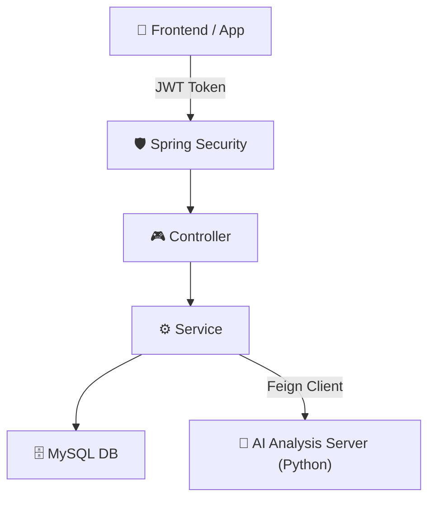

# 2026년도 캡스톤 BE part

구독 관리 서비스 Spring Boot 서버입니다.

## 사전에 설치해야 하는 것
1. Java 17 (JDK 17) 이상
2. MySQL (포트는 3306)

## 실행 가이드 ( 내부 )
### 1단계 : DB 세팅 ( 최초 1회만 )
MySQL 터미널이나 WorkBench에서 아래 SQL문을 실행해주세요.
PW는 1234로 설정해뒀습니다. 
만약 문제가 생기면 src/main/resources/application.yml 에서 확인해주세요.
이 부분은 추후에 변경할 예정입니다.
```sql
1. 데이터베이스 생성
CREATE DATABASE subscription_db;

2. 서버가 켜질 때까지 대기!
먼저 아래 '2단계: 서버 실행'을 해서 서버를 한 번 켰다 꺼주세요. 
(서버가 켜지면 테이블이 자동으로 생성됩니다.)

3. 임시 테스트 유저 생성 
USE subscription_db;
INSERT INTO users (email, name, password, is_notify_enabled, created_at) 
VALUES ('test@abc.com', '테스트유저', '1234', 1, NOW());
```

### 2단계 : 서버 실행
터미널을 키고, 프로젝트 폴더로 들어가셔서 다음 명령어를 입력해주세요
<br>Mac / Linux : 
```
./gradlew bootRun
```
<br>Windows :
```
gradlew.bootRun
```

### 3단계 : 접속 확인
서버가 켜지면 아래 주소로 접속 가능합니다 ( 내부 )
<br> 서버 상태 확인 : http://localhost:8080/api/status
<br> Swagger API 명세서 : http://localhost:8080/swagger-ui/index.html

외부 환경에서 접속하실 때는 다음 주소로 접속해주세요. 
<br> 현재 개발 단계에서는 Ngrok을 사용하고 있습니다.
<br> 배포 전까지는 이 방식을 사용하여야 하니 양해 부탁드립니다.

<br> Base URL : 변경될때마다 공지하겠습니다.

<br> Swagger API 명세서(외부) : {Base URL}swagger-ui/index.html
<br> 사용 예시 : https://{Base URL}/api/auth/login

## 인증(Authentication) 테스트 방법
1. Swagger에서 Auth 태그의 로그인(Sign-in) API를 호출합니다.

2. 응답받은 token 값을 복사합니다. (따옴표 제외)

3. 우측 상단 Authorize 버튼을 클릭합니다.

4. 입력창에 토큰을 붙여넣고 Authorize -> Close를 누릅니다.

5. 이제 자물쇠가 잠긴 상태에서 다른 API를 테스트할 수 있습니다.

## 테스트 유저

email : test@test.com<br>
password : 1234<br>
name : 테스트유저<br>
로 생성해뒀습니다.


<br> 아직 초기 설정만 해둔 상태입니다
<br>문제가 생기면 연락주세요



